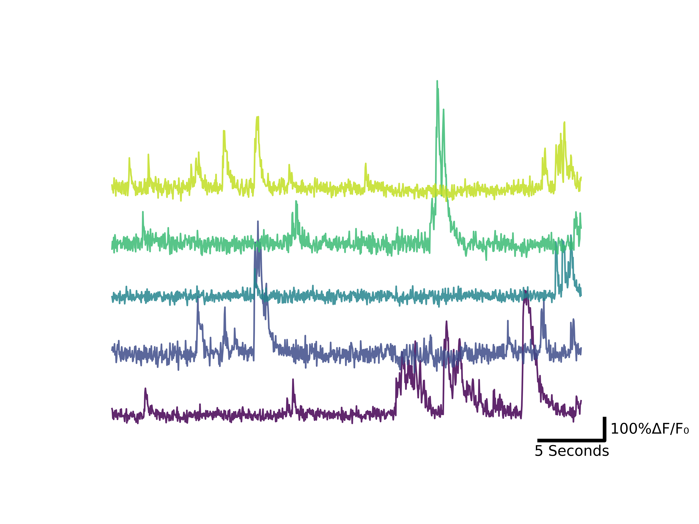

# Calciumplot
Minimal notebooks and scripts for calculating DF/F0 and plotting 2p calcium traces with matplotlib or live with plotly for browsing data. Data available upon request.

Related to https://www.biorxiv.org/content/10.1101/2021.05.14.443815v1 , with some additions for the final version of the paper.

